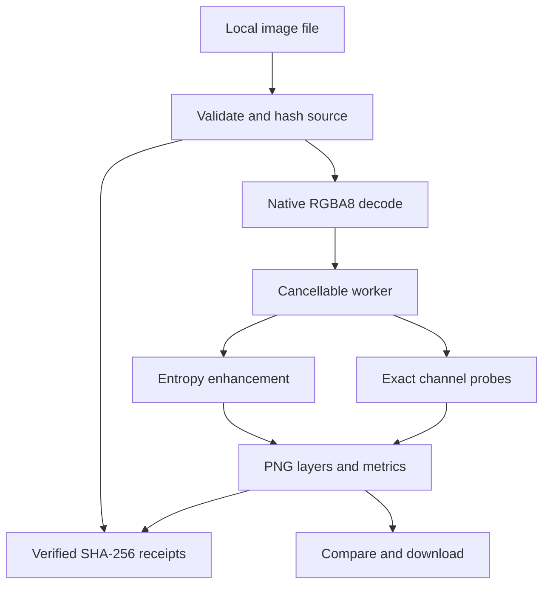

# Repository review and refinement

Reviewed baseline: `66e1350bf3da43bf2c9fc951067f5e2ce387b069`.

The existing application has a coherent four-workspace product structure and
a local image-processing path. The most consequential gaps were between
method names, measured values, displayed references, and exported artifacts.

## Findings addressed

| Baseline finding | Refinement |
| --- | --- |
| Enhancement downsized to 1,100 px; probes downsized to 900 px | Native dimensions through processing and export, with explicit decoded-size limits |
| “Entropy” was a saturated four-neighbor contrast score | Shannon entropy in bits over a 9×9 reflected window, independently checked against a histogram reference |
| Sharpening subtracted red-only neighbor averages from luminance | Consistent luminance samples with alpha weighting; strength 1 identity and constant-color invariants |
| KELD was a channel-spread threshold | Port the archive's actual STAR8 K-Elimination |
| Lane probe mixed absolute RGB differences and a broad edge band; wrapped row boundaries | Residue-native signed ±1 selection on lanes 7/11/13, correct horizontal and vertical boundaries |
| Quantization probe counted RGB multiples of eight | Port block step-GCD and background-step estimation, including partial edges |
| Processing ran on the UI thread; pending results could outlive source or probe selection | Cancellable workers, image-scoped probes, guarded asynchronous completions, resource cleanup |
| Invalid files silently failed; advertised size limit was unenforced | File and dimension validation, visible decode/processing errors, prior image retained after a failed replacement |
| Parameters could differ from displayed output without a signal | Result recipe captured and changed-recipe status displayed |
| Spectral references were decorative gradients | Seven real bundled reference PNGs, full-size links, source attribution, base-path-aware URLs |
| Receipt status always said “Intact”; FNV checksum included no source/output identity | SHA-256 source/raster/output identities, verified persisted chain, verified export, preserved legacy receipts |
| localStorage errors and malformed settings could break startup | Validated settings, explicit memory fallback, preserved corrupt receipt export |
| No regression suite or CI | Node built-in tests, workspace typecheck, production frontend build in GitHub Actions |
| Frontend required Replit environment variables | Local defaults for port and base path, standalone run instructions |

## Architecture after refinement

The archived CRAM-DSP source was inspected directly. The numerical browser
ports are limited to STAR8, lane-comb, and block-GCD probes. The app's visual
entropy/sharpening path has its own method contract. No archived benchmark
claims are treated as newly validated browser results.

## Next opportunities, in order

1. **Native 16-bit and spectral ingestion.** Typed 16-bit buffers, TIFF band
   import, bit-depth-driven lane sets, and acquisition receipts would connect
   the rest of CRAM-DSP to the app. Gate: byte/value fixtures from the archive,
   decoding parity, and exact per-band method parity before exposing controls.
2. **Region inspection and tiled execution.** Pixel coordinates, zoom, linked
   pan, and region-of-interest probes would make small manuscript details
   easier to inspect. Tiled neighborhoods need halo/boundary parity with
   full-image results before lifting the current memory limits.
3. **Reversible transforms and replay.** Expose archived wavelet/lifting
   transforms with actual inverse round-trip receipts, plus recipe import and
   replay against a matching source digest. Gate: byte-identical reconstruction.
4. **Spectral registration and band tools.** Load aligned band sets, then
   offer explicit difference/ratio and separation operations. Gate: alignment,
   missing-band behavior, denominator handling, and provenance for each band.
5. **Comparison and performance fixtures.** Add real-device memory profiling
   and archive-to-browser parity fixtures across opaque/transparent formats.
   Keep the present exactness checks and native-dimension export checks as
   required gates.

## Validation

The implementation includes exhaustive checks of all 65,536 8-bit sample
pairs for lane selection and all 1,332 valid STAR8 inputs. Additional tests
cover independent Shannon-entropy calculations, flat fields, transparent
pixels, neutral-strength identity, clipping, partial GCD blocks, size limits,
SHA-256 known answers, altered receipt rejection, and settings recovery.

See the pull request for the executed build, typecheck, and browser results.
